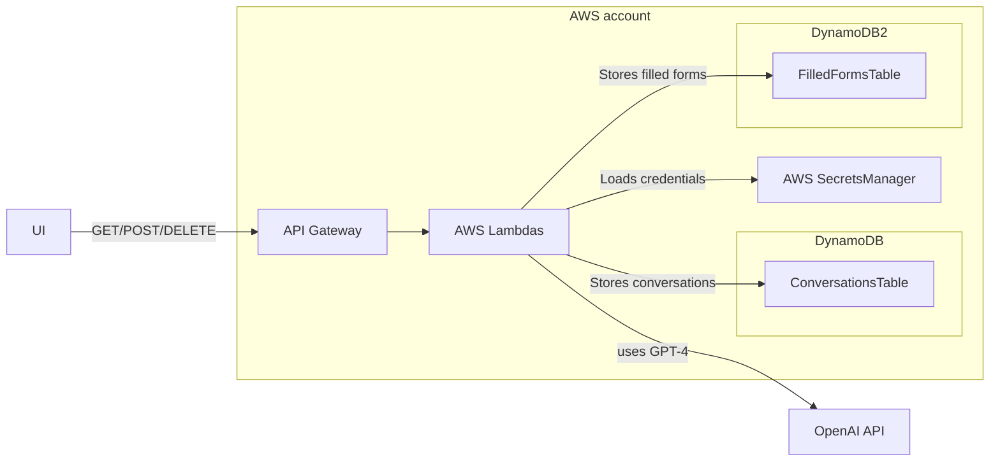

## Insurance Fills Service

This service empowers users, typically insurance claimants, to detail their claim or describe their issue. After answering a few supplementary questions, their claim data will be securely stored in the insurance company's database.

The project is constructed as Infrastructure-as-Code (IaC), utilizing the AWS Cloud Development Kit (CDK), which generates a CloudFormation template. AWS Lambda is deployed via a Docker image, a necessary choice due to its capacity to accommodate up to 10GB in dependencies, as compared to a modest limit of 128MB for all dependencies otherwise.

The Lambda function interfaces with OpenAI language models, which parse the user's responses and pose follow-up questions. Following this interaction, the claim data is stored in AWS DynamoDB. Notably, all conversation data is also retained in DynamoDB for future reference and analysis.

To execute the files under the notebooks/ directory, add the OpenAI API key OPENAI_API_KEY to the .env file. This will enable the seamless interaction with OpenAI's language models.



## Setup

To install dependencies:

```
poetry install
```

Install pre-commit hooks:
```
poetry run pre-commit install
```


Add new python dependency:
```
poetry add new-package-name
```


### Deployment

Activate environment (optional):
```
poetry shell
```

Export environment variables for AWS CDK:

```
export AWS_ACCESS_KEY_ID=
export AWS_SECRET_ACCESS_KEY=
```

To deploy on Mac OS:

```
DOCKER_DEFAULT_PLATFORM=linux/amd64 cdk deploy  --all
```

### Run

To run streamlit frontend:
```
streamlit run frontend/frontend_app.py
```
